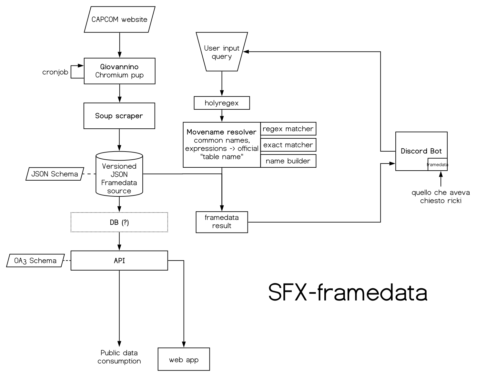

<div align="center">
    
    <h1>SFX Framedata </h1>
    <p>
        <b>Discord bot providing Street Fighter V frame data for the specified character and move. Supports unofficial common move names and shorthands.</b>
    </p>
    <br>
    <br>
    <br>
</div>

Built and mantained by [ricki122](https://twitter.com/ricki122), [Antonio Vivace](https://twitter.com/avivace4), [d3nnib](https://twitter.com/dennibevilacqua)

## Usage

Add the bot to your Discord server with this [invite link](). Then, you can start using its commands.

## Commands

* `!fd`: 
    Get SFV frame data for the specified char and move. ```!fd Ryu cr.mk```
* `!help`: 'Get help on a command. Usage ```!help command_name```
* `!info`: 'Get suppport/feedback contacts and show some technical data. Usage ```!info```


## Run

These instructions are for self-hosting your own bot and your own data scraping/processing daemon. Some technical knowledge is required.
If you just want to use the bot, check [Usage](#usage).

#### 0. Requirements

Python3 and a recent version of Node are required.

```
# Clone the repository
git clone https://github.com/avivace/sfx-framedata
cd sfx-framedata

# Install pipenv
pip install --user pipenv

# Activate the virtualenv
pipenv shell
# Install python dependencies
pipenv install
```

You should now be ready to run everything.

Run tests:
```
pytest discord/test.py
```

#### 1. Data pulling

*Giovannino* is a node script powered by Puppeteer to pull raw HTML pages from capcom website. Handles the steam login.

Get things ready:

```
cd pup
sudo sysctl -w kernel.unprivileged_userns_clone=1
npm install
```

Run:

```
node index.js
```

This stage produces a folder with a dumped HTML file for each character.

#### 2. Data scraping

This stage takes the HTML dumps and scrapes them, producing a JSON file containing every move (for VT1 and VT2) for every character, according to the `datamodel` JSON schema.

TODOCUMENT (`data/` folder)


#### 3. Discord Bot

Runs on discord-py 1.31 or more recent (post-rewrite API).

[Create a Discord Bot](https://discordpy.readthedocs.io/en/latest/discord.html). Put the token (not the secret) in the `conf/bots.yaml` configuration file.

```bash
cd discord
python3 -m venv .
source bin/activate
pip3 install -r requirements.txt
python3 discord-bot.py
```
#### 4. API (WIP)

Run

```
cd api
python3 server.py
```

Endpoints:

```
localhost:8080/api/v1/$METHOD$
localhost:8080/api/v1/ui
```

#### 5. Web app (WIP)

```
cd sfxweb
npm install
npm run serve
npm run deploy
```


## Architecture




### Notes

Originally based on [Yaksha](https://github.com/ellipses/Yaksha) bot by [ellipses](https://github.com/ellipses)


Rewriting history because Antuz commits passwords in clear:

```bash
git clone --bare git@github.com:avivace/sfx-framedata.git
java -jar bfg-1.13.0.jar --replace-text password.txt sfx-framedata.git/
git reflog expire --expire=now --all && git gc --prune=now --aggressive
git push (-f ?)
git grep PASSWORD $(git rev-list --all)
# not working 
# ! [remote rejected] refs/pull/1/head -> refs/pull/1/head (deny updating a hidden ref)
# probably for the previous commits (PR?)

```
